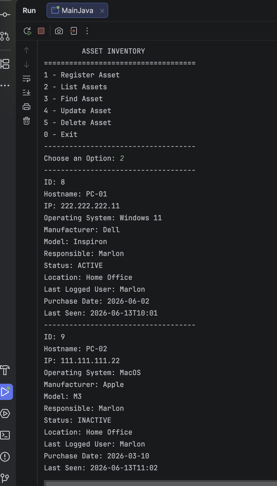

# Sentinel

Sistema de gerenciamento de assets de TI desenvolvido em Java.

> Projeto iniciado originalmente como **Asset Inventory** e evoluído para **Sentinel**, com foco em inventário, controle e futura expansão para funcionalidades relacionadas à segurança da informação.

## Sobre o projeto

O Sentinel é uma aplicação desenvolvida para simular um sistema utilizado por um departamento de tecnologia para controle de computadores e equipamentos de uma organização.

O objetivo do projeto é aplicar conceitos de desenvolvimento de software, criando uma base que futuramente poderá evoluir para uma solução corporativa envolvendo API REST, autenticação, autorização, logs de auditoria, gestão de vulnerabilidades e funcionalidades relacionadas à segurança da informação.

Nesta versão, o projeto evoluiu de um armazenamento em memória para persistência de dados em banco PostgreSQL utilizando JDBC.

## Demonstração

Abaixo está uma demonstração da aplicação em execução.



## Funcionalidades atuais

* Cadastro de assets
* Listagem de assets
* Busca de assets por ID
* Atualização de informações
* Remoção de assets
* Persistência de dados em PostgreSQL
* Menu interativo via terminal

## Modelo de asset

Cada equipamento possui informações como:

* ID
* Hostname
* IP
* Operating System
* Manufacturer
* Model
* Responsible

O ID é gerado automaticamente pelo banco de dados.

## Tecnologias utilizadas

* Java
* Maven
* PostgreSQL
* JDBC
* SQL
* Programação Orientada a Objetos (POO)
* Tratamento de exceções
* Git

## Conceitos aplicados

Durante o desenvolvimento foram praticados:

* Classes e objetos
* Encapsulamento
* Separação de responsabilidades entre camadas
* CRUD com banco de dados
* Integração com PostgreSQL utilizando JDBC
* Uso de PreparedStatement
* Leitura de dados com ResultSet
* Tratamento de exceções
* Uso de variáveis de ambiente para dados sensíveis
* Versionamento utilizando Git

## Estrutura do projeto

O projeto foi organizado seguindo uma separação de responsabilidades:

* Model: entidades do sistema
* Service: regras de negócio
* Repository: gerenciamento dos dados e operações com o banco
* Database: configuração da conexão com o PostgreSQL
* UI: interação com o usuário

## Banco de dados

O projeto utiliza um banco PostgreSQL chamado `sentinel`.

Script utilizado para criação da tabela `assets`:

```sql
CREATE TABLE assets (
    id INTEGER GENERATED ALWAYS AS IDENTITY PRIMARY KEY,
    hostname VARCHAR(50),
    ip VARCHAR(20),
    operating_system VARCHAR(50),
    manufacturer VARCHAR(50),
    model VARCHAR(50),
    responsible VARCHAR(50)
);
```

## Variáveis de ambiente

Para evitar deixar dados sensíveis diretamente no código, a aplicação utiliza variáveis de ambiente para a conexão com o banco.

Variáveis necessárias:

```text
DB_URL
DB_USER
DB_PASSWORD
```

Exemplo de configuração local:

```text
DB_URL=jdbc:postgresql://localhost:5432/sentinel
DB_USER=postgres
DB_PASSWORD=sua_senha_do_postgresql
```

Essas variáveis devem ser configuradas no ambiente local ou na configuração de execução da IDE antes de rodar a aplicação.

## Como executar

1. Clone o repositório:

```bash
git clone https://github.com/marlonbrunotech/asset-inventory.git
```

2. Abra o projeto em uma IDE Java.

3. Crie o banco de dados PostgreSQL chamado `sentinel`.

4. Crie a tabela `assets` utilizando o script disponível na seção **Banco de dados**.

5. Configure as variáveis de ambiente necessárias:

```text
DB_URL=jdbc:postgresql://localhost:5432/sentinel
DB_USER=postgres
DB_PASSWORD=sua_senha_do_postgresql
```

6. Compile o projeto com Maven:

```bash
mvn compile
```

7. Execute a classe principal da aplicação.

## Roadmap de evolução

### Versão atual

* Aplicação Java via terminal
* CRUD de assets
* Persistência em banco PostgreSQL utilizando JDBC
* Gerenciamento de dependências com Maven
* Configuração de conexão utilizando variáveis de ambiente

### Próximas versões


* API REST utilizando Spring Boot
* Autenticação e autorização com controle de permissões
* Logs de auditoria
* Gestão de vulnerabilidades dos assets
* Interface web utilizando Angular
* Funcionalidades voltadas para segurança da informação

## Objetivo

Este projeto faz parte da minha jornada de aprendizado em desenvolvimento de software, com foco futuro em cybersecurity.